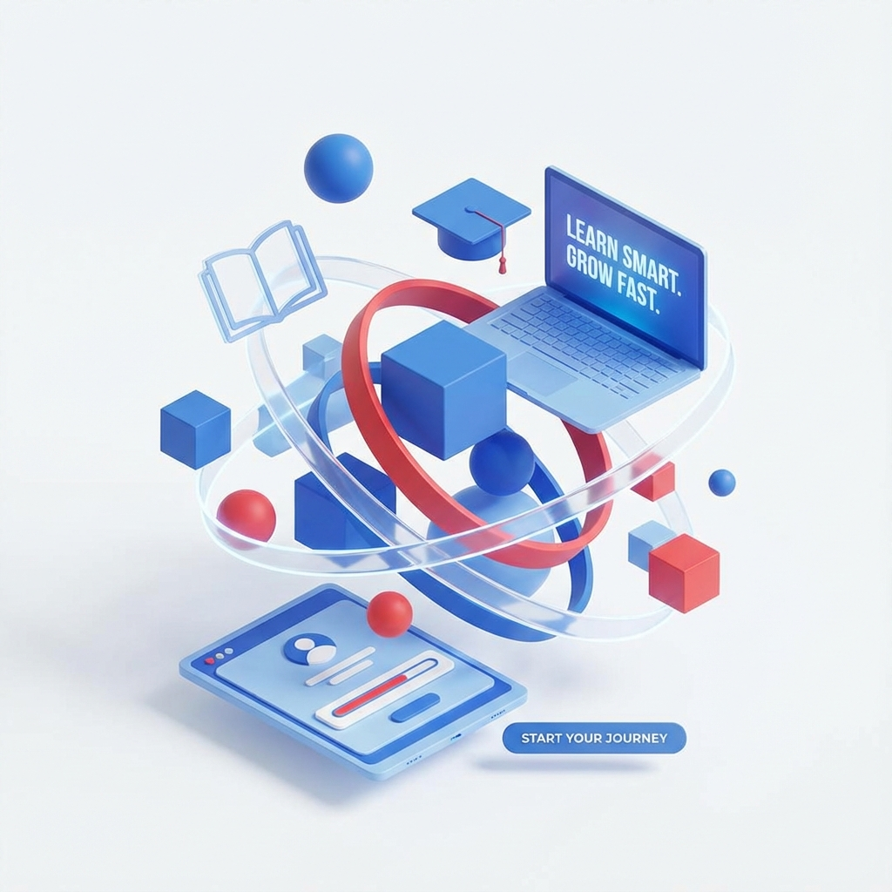

# <p align="center">🎓 Creative LMS</p>

<p align="center">
  
  
  
  
  
</p>

<p align="center">
  <strong>A modern, high-performance Learning Management System built for the future of education.</strong>
</p>

---

## 🌟 Overview

**Creative LMS** is a full-featured platform designed to provide an immersive learning experience. From a sleek student dashboard to a powerful administrative control center, it streamlines the entire educational process.

<p align="center">
  
</p>

## ✨ Key Features

### 👨‍🎓 For Students
- **🚀 Interactive Dashboard**: Personal progress tracking and quick access to courses.
- **📚 Lesson Store**: A beautiful marketplace to discover and enroll in new learning paths.
- **📊 Paper Marks**: Instant access to grades and detailed feedback on assignments.
- **🔔 Real-time Notices**: Stay informed with the latest campus announcements.
- **💳 Seamless Payments**: Integrated payment systems for course enrollment.

### 👩‍💼 For Admins
- **🛠️ Course Management**: Effortlessly create, edit, and organize lessons and papers.
- **👥 Student Oversight**: Comprehensive tools to monitor student performance and engagement.
- **📈 Sales Analytics**: Real-time tracking of course sales and financial performance.
- **🎥 Live Integration**: Built-in Zoom support for scheduling and managing live sessions.
- **✉️ Communication Hub**: Centralized system for notifications and direct messaging.

## 🛠️ Tech Stack

| Category | Technology |
| :--- | :--- |
| **Framework** | [Next.js 16 (App Router)](https://nextjs.org/) |
| **UI Library** | [React 19](https://react.dev/) |
| **Styling** | [Tailwind CSS](https://tailwindcss.com/) |
| **Animations** | [Framer Motion](https://www.framer.com/motion/) |
| **Database/Auth** | [Supabase](https://supabase.com/) |
| **Media** | [Cloudinary](https://cloudinary.com/) |
| **Icons** | [Lucide React](https://lucide.dev/) |

## 🚀 Getting Started

### Prerequisites
- Node.js 18+
- npm / yarn / pnpm / bun
- Supabase account
- Cloudinary account (for media uploads)

### Installation

1. **Clone the repository**
   ```bash
   git clone https://github.com/your-username/lms-app.git
   cd lms-app
   ```

2. **Install dependencies**
   ```bash
   npm install
   ```

3. **Set up environment variables**
   Create a `.env.local` file in the root directory and add your credentials:
   ```env
   NEXT_PUBLIC_SUPABASE_URL=your_supabase_url
   NEXT_PUBLIC_SUPABASE_ANON_KEY=your_supabase_anon_key
   NEXT_PUBLIC_CLOUDINARY_CLOUD_NAME=your_cloud_name
   ```

4. **Run the development server**
   ```bash
   npm run dev
   ```

Open [http://localhost:3000](http://localhost:3000) with your browser to see the result.

## 📂 Project Structure

```text
src/
├── actions/        # Server actions for data mutations
├── app/            # Next.js App Router (pages & layouts)
│   ├── (auth)/     # Authentication routes
│   ├── admin/      # Admin dashboard & management
│   └── dashboard/  # Student portal
├── components/     # Reusable UI components
├── lib/            # Utility functions & shared configurations
└── middleware.ts   # Authentication & route protection
```

---

<p align="center">Made with ❤️ for a better learning experience.</p>
